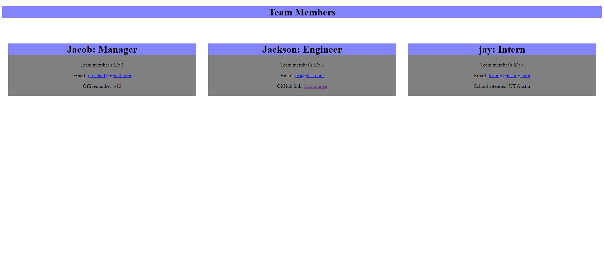
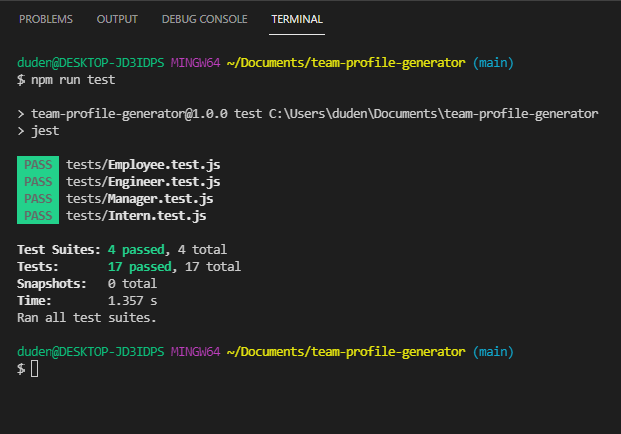

# team-profile-generator   

## Description
   This node.js application takes user input within the terminal to generate an html page with the information provided. The "Manager" can input as many interns, or engineers as needed.

## Images
   Demonstration video:

   Generated HTML page:

   

   ## Tests

   This application was tested using Jest.js to test class syntaxes and constructor functions made for each employee of the team.

   

   ## How to use

   After running "npm install" to update node modules, type in the terminal "node index.js" to start the application!